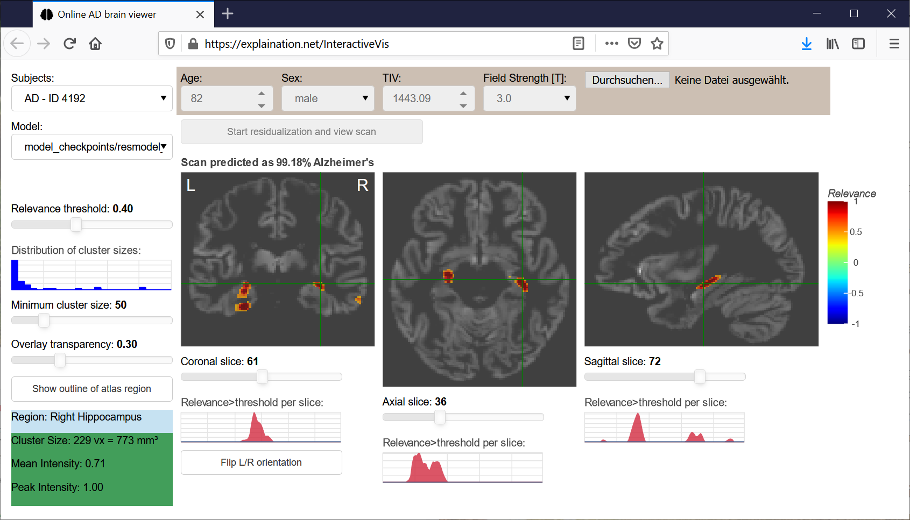

# Deep Learning Interactive Visualization

This project contains all code to learn a convolutional neural network model to detect Alzheimer's disease and visualize contributing brain regions with high relevance.
 
**Further details on the procedures including samples, image processing, neural network modeling, evaluation, and validation were published in:**

Dyrba et al. (2021) Improving 3D convolutional neural network comprehensibility via interactive visualization of relevance maps: evaluation in Alzheimer’s disease. *Alzheimer's research & therapy* 13. DOI: [10.1186/s13195-021-00924-2](https://doi.org/10.1186/s13195-021-00924-2).


*Screenshot of the InteractiveVis app*


***


### Running the interactive visualization

The interactive Bokeh web application [InteractiveVis](InteractiveVis) can be used for deriving and inspecting the relevance maps overlaid on the original input images.

To run it, there are three options.

1. **We set up a public web service to quickly try it out:** <https://explaination.net/demo>

2. Alternatively, download the docker container from DockerHub: `sudo docker pull martindyrba/interactivevis`
Then use the scripts `sudo ./run_docker_intvis.sh` and `sudo ./stop_docker_intvis.sh` to run or stop the Bokeh app. (You find both files above in this repository.)
After starting the docker container, the app will be available from your web browser: <http://localhost:5006/InteractiveVis>

3. Download this Git repository. Install the required Python modules (see below). Then point the Anaconda prompt or terminal console to the DeepLearningInteractiveVis main directory and run the Bokeh app using:
`bokeh serve InteractiveVis --show`


### Requirements and installation:

To be able to run the interactive visualization from the Git sources, you will need Python <3.8, in order to install tensorflow==1.15.
Also, we recommend to first create a new Python environment (using [Anaconda](https://www.anaconda.com/download) or [virtualenv/venv](https://packaging.python.org/guides/installing-using-pip-and-virtual-environments/)) to avoid messing up your local Python modules/versions when you have other coding projects or a system shared by multiple users.
```console
# for Anaconda:
conda create -n InteractiveVis python=3.7
conda activate InteractiveVis
```

Run pip to install the dependencies:
```console
pip install -r requirements.txt
```

Then you can start the Bokeh application:
```console
bokeh serve InteractiveVis --show
```


***


### CNN model training and performance evaluation

The code for training the CNN models and evaluation is provided in this repository in the subdirectory [scripts](scripts).
The order of script execution was as follows:

- [1_CreateResiduals_ADNI2_StoreModels.ipynb](scripts/1_CreateResiduals_ADNI2_StoreModels.ipynb) and other scripts for the validation samples [4_CreateResiduals_DELCODE_applying_ADNI2_regr_model.ipynb](scripts/4_CreateResiduals_DELCODE_applying_ADNI2_regr_model.ipynb) (execution time: each 15-30 minutes).
- [2_Train_3D_CNN_ADNI2_xVal_wb_mwp1_CAT12_MNI_shuffle_checkpoint.ipynb](scripts/2_Train_3D_CNN_ADNI2_xVal_wb_mwp1_CAT12_MNI_shuffle_checkpoint.ipynb) for model training based on tenfold cross-validation to evaluate general model accuracy for the residualized data (execution time: 2-10 hrs with CUDA-GPU) and [3_Train_3D_CNN_ADNI2_whole_dataset_wb_mwp1_CAT12_MNI_shuffle.ipynb](scripts/3_Train_3D_CNN_ADNI2_whole_dataset_wb_mwp1_CAT12_MNI_shuffle.ipynb) for training the model based on the whole ADNI-GO/2 dataset.
- [5_Validate_3D_CNN_xVal_wb_mwp1_CAT12_MNI_DELCODE.ipynb](scripts/5_Validate_3D_CNN_xVal_wb_mwp1_CAT12_MNI_DELCODE.ipynb) and [6_Validate_3D_CNN_whole_ds_wb_mwp1_CAT12_MNI_DELCODE.ipynb](scripts/6_Validate_3D_CNN_whole_ds_wb_mwp1_CAT12_MNI_DELCODE.ipynb) for the evaluation of the models using the validation data sets (execution time: each 15-30 minutes with CUDA-GPU).
- [7_Train_3D_CNN_ADNI2_xVal_wb_rawdat_mwp1_CAT12_MNI_shuffle_checkpoint.ipynb](scripts/7_Train_3D_CNN_ADNI2_xVal_wb_rawdat_mwp1_CAT12_MNI_shuffle_checkpoint.ipynb) and [8_Train_3D_CNN_ADNI2_whole_dataset_wb_rawdat_mwp1_CAT12_MNI_shuffle.ipynb](scripts/8_Train_3D_CNN_ADNI2_whole_dataset_wb_rawdat_mwp1_CAT12_MNI_shuffle.ipynb) for training the models for the raw datasets (execution time: each 2-10 hrs with CUDA-GPU).
- [9_Validate_3D_CNN_whole_ds_wb_rawdat_mwp1_CAT12_MNI_DELCODE.ipynb](scripts/9_Validate_3D_CNN_whole_ds_wb_rawdat_mwp1_CAT12_MNI_DELCODE.ipynb) and [9_Validate_3D_CNN_xVal_wb_mwp1_CAT12_MNI_DELCODE.ipynb](scripts/9_Validate_3D_CNN_xVal_wb_mwp1_CAT12_MNI_DELCODE.ipynb) for the evaluation of the models using the validation data sets (execution time: each 15-30 minutes with CUDA-GPU).
- [x_extract_hippocampus_relevance_lrpCMP_DELCODE.ipynb](scripts/x_extract_hippocampus_relevance_lrpCMP_DELCODE.ipynb) to extract the hippocampus relevance for all models (execution time: 15-30 minutes with CUDA-GPU).
- [x_extract_relevance_maps_as_nifti_DELCODE.ipynb](scripts/x_extract_relevance_maps_as_nifti_DELCODE.ipynb) to extract the relevance maps directly as nifti file for all participants/scans (execution time: 30 minutes with CUDA-GPU).
- [hippocampus_volume_relevance_analysis_DELCODE.html](scripts/hippocampus_volume_relevance_analysis_DELCODE.html) for the baseline group separation analysis of hippocampus volume and the correlation analysis of hippocampus volume and relevance (see also other R/Rmd scripts).
- [y_occlusion_analysis.ipynb](scripts/y_occlusion_analysis.ipynb) code for the occlusion sensitivity analysis (execution time: 90 minutes with CUDA-GPU).
- [z_CreateResiduals_demo_dataset_applying_ADNI2_regr_model.ipynb](scripts/z_CreateResiduals_demo_dataset_applying_ADNI2_regr_model.ipynb) to create the example files being used by the InteractiveVis demo. It contains a sample of 15 people per diagnostic group, representatively selected from the ADNI-2 phase based on the criteria: amyloid status (positive for Alzheimer's dementia and amnestic mild cogntive impairment, negative for controls), MRI field strength of 3 Tesla, RID greater than 4000, and age of 65 or older. 


***


### InteractiveVis architecture overview

*InteractiveVis UML class diagram (v4)*


*Select subject UML sequence diagram (v3)*


***


### License:

Copyright (c) 2020 Martin Dyrba martin.dyrba@dzne.de, German Center for Neurodegenerative Diseases (DZNE), Rostock, Germany

This project and included source code is published under the MIT license. See [LICENSE](LICENSE) for details.
