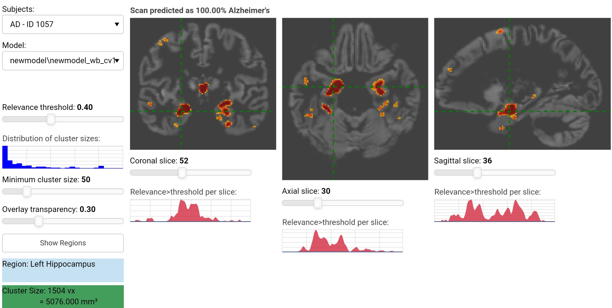

# Deep Learning Interactive Visualization

This folder contains all code to learn a deep learning model to detect Alzheimer's disease and visualize contributing brain regions with high relevance.
The model structure has higher stability for whole-brain data as the first model used only on hippocampal coronal slices (reduced field-of-view).
Publishing of the results is in preparation (Sept. 2020).

Order of script execution:
1. [CreateResiduals-ADNI2.ipynb](CreateResiduals-ADNI2.ipynb) and other scripts for the validation samples [CreateResiduals-ADNI3.ipynb](CreateResiduals-ADNI3.ipynb) (execution time: each 15-30 minutes)
2. [DeepLearning3DxVal_wb_win_mwp1_MNI_newStructure_dr0.1.ipynb](DeepLearning3DxVal_wb_win_mwp1_MNI_newStructure_dr0.1.ipynb) for model training based on twenty-fold cross-validation to evaluate general model accuracy (execution time: 2-10 hrs with CUDA-GPU?)
3. [CalcAccuracyPerGroup_ADNI2.ipynb](CalcAccuracyPerGroup_ADNI2.ipynb) and [CalcAccuracyPerGroup_ADNI2_Amy.ipynb](CalcAccuracyPerGroup_ADNI2_Amy.ipynb) to calculate the accuracy/AUC per comparison MCI vs. CN and AD vs. CN
4. [DeepLearning3DxVal_wb_win_mwp1_MNI_newStructure_validationADNI3_dr0.1.ipynb](DeepLearning3DxVal_wb_win_mwp1_MNI_newStructure_validationADNI3_dr0.1.ipynb)
5. [extract_relevance_maps_as_nifti.ipynb](extract_relevance_maps_as_nifti.ipynb) to extract the relevance map overlays as nifti file for all participants/scans for a single model

The interactive bokeh application [InteractiveVis](InteractiveVis) can be run for inspecting the created relevance maps overlaid on the original input images. Here, point the anaconda prompt to the DeepLearningInteractiveVis dir and then run bokeh using:
```
bokeh serve InteractiveVis --show
```

*Screenshot of the InteractiveVis app*

***

### Requirements and installation:

To be able to run the visualization software, you need Python 2 or 3, specifically <3.8, in order to install tensorflow==1.15
Note: on some systems it is recommended to install some dependencies using the default package manager instead of pip. e.g.
`sudo apt-get install python-numpy python-scipy python-tk`
or
`sudo yum install scipy numpy tkinter`

Run pip/pip3 to install the dependencies:
`pip install -r requirements.txt`

Downgrade to h5py==2.10 if you get an error message when loading the tensorflow models `pip3 install -U "h5py==2.10"` (there seems to be an open bug in h5py 3.0 and 3.1, <https://github.com/tensorflow/tensorflow/issues/44467>)


### License:

Copyright (c) 2020 Martin Dyrba martin.dyrba@dzne.de, German Center for Neurodegenerative Diseases (DZNE), Rostock, Germany

This project and included source code is published under the MIT license. See [LICENSE](LICENSE) for details.
